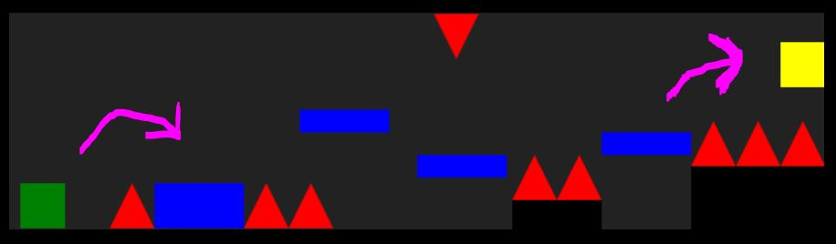

# Speedy-Shapes

You know how you never wanted to be stuck in a loop avoiding shapes flying at you in high-speed, well too bad! Introducing Speedy Shapes, you will play as Cringy the Cube making his way through the obstacle course that he can't seem to stop waking up in. Cringy must go through both levels to return back to his own reality and break the cycle once and for all.

---

## Tech Stack

- HTML
- CSS
- Javascript
- Canvas

---

## Wireframe

---

## MVP Goals

- Create starting screen inside the Game Boy screen area
- Make the cube jump and fall back down
- Make blocks for the cube to jump on
- Make Triangles the cube dies from touching
- If the cube dies send it back to the start of that current level
- Make shapes scroll across the screen
- Continue obstacles until sending the end portal taking you to the next level
- Change our dafault cube to have a face
- Create second level with a different obstacle course
- Final portal to win and end the game
- Keep track of deaths in a counter on screen

---

## Stretch Goals

1. Make monsters to bounce on mid air
2. Add a 3rd level
3. Add a High-Score counter
4. Add new obstacles(ex. falling blocks)
5. Give our cube a trail
6. Make the cube rotate 90 deg on jumps

---

## Potential Roadblocks

- making sure the face square I put on the cube matches the hit box correctly
- setting up the levels to scroll at a speed that is fast enough to make jumps but not too fast you just go past platforms
- making the second level load after hitting the portal
- how to time what blocks spawning when
